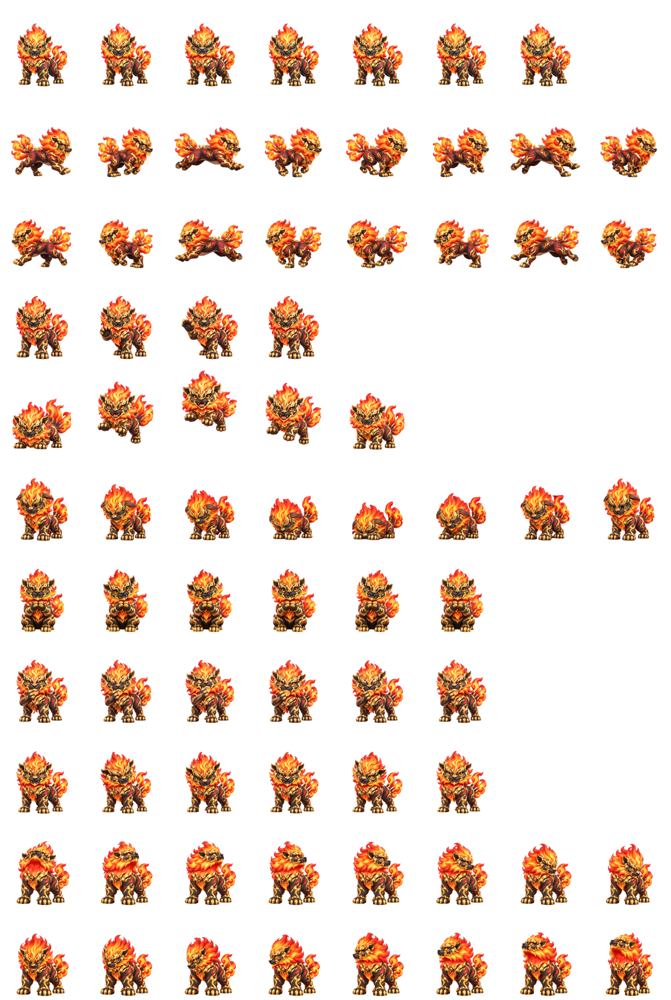

# 祥瑞小虎 Codex Pet 🐯

裴擒虎「祥瑞亨通」虎形态的非官方 Codex 自定义桌宠。

## Preview



## Pet Information

- Name: 祥瑞小虎
- ID: `custom:xiangrui-tigers`
- Sprite Version: v2

## Installation

将 `xiangrui-tigers` 文件夹放入 Codex 自定义宠物目录即可。

目录结构：

```
pets/
└── xiangrui-tigers/
    ├── pet.json
    └── spritesheet.webp
```

## Files

- `pet.json` - Codex Pet v2 manifest
- `spritesheet.webp` - Animated sprite atlas

Fan-made project, free to use.